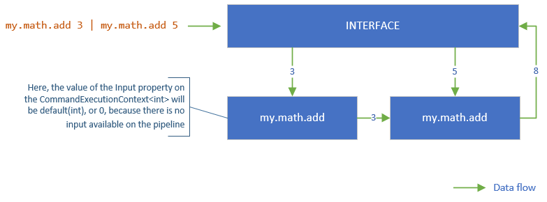

# Pipeline
The command line application moves data from the from the Interface (see, [IInterface](IInterface.md)), through one or more command executions (which perform operations using the data, including making changes to the data), and back to the interface as output.


Using the following command type ...

```cs
    [Command(Namespace="my.math", Name="add")]
    class CommandWithArgument : CommandBase
    {
        [Argument(Alias='n')]
        public int Num { get; set; }

        public int Execute(CommandExecutionContext<int> ctx)
        {
            return ctx.Input + Num;
        }
    }
```

We see that the command can receive an integer input from the pipeline (or default(T) if not input is available), and the command writes the results of adding the input to the Num argument back to the pipeline.

See [command inputs and outputs](Commands.md#inputs-and-outputs) for more information on how inputs and outputs are defined.

We can string multiple executions of this command together on the pipeline using the following [string command expression](CommandSyntax.md).

```my.math.add 5 | my.math.add 3```

When this expression is run, the execution will ultimately return the integer  8 to the interface which will simply dump the string representation of the value. For example, if using the default System.Console interface, the string representation of 8 will simply be written to the console (see [configuring the interface](CommandLineApplicationBuilder.md#configuring-the-interface) for more information).




For more information on syntax, see [Command Line Syntax](CommandSyntax.md).

When stringing commands together on the pipeline, data types must be compatable. The pipeline will not attempt to convert data to match a commands input type. For example, if the first command on the pipeline returns a *string* and the next command accepts an *int*, the command line application will abort execution and throw an exception which will be written to the interface as an error. This is also true if a command returns data, but a subsequent command doesn't accept input. However, a command may not return any output, but can be followed by a command that accepts input - in this case, the command that accepts input won't find any input on the pipeline and will use default(T) for the input value (where T is the generic type parameter of the [CommandExecutionContext](CommandExecutionContext.md)).

---
See also,

- [IInterface](IInterface.md)
- [Command Line Syntax](CommandSyntax.md)
- [CommandExecutionContext](CommandExecutionContext.md)


